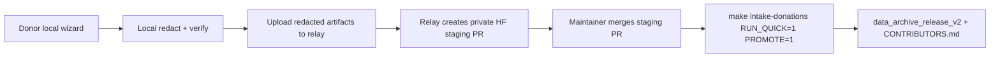

# ContextEcho Donation Relay

The public donation flow should use a server-side relay. The relay receives only
already-redacted artifacts, stores the Hugging Face staging token as a server
secret, and opens a private staging pull request for maintainer review.

## Why

Do not put `HF_STAGING_TOKEN`, `CONTEXTECHO_DONATE_TOKEN`, or any maintainer
write token in the public repository. A public donor clone should only know the
relay URL.

## Flow



## Run Locally

Install relay dependencies:

```bash
make setup-relay PYTHON=.venv/bin/python
```

Start the relay with a maintainer token stored in the environment:

```bash
HF_STAGING_TOKEN=hf_xxx make run-relay PYTHON=.venv/bin/python
```

The default relay URL is:

```text
http://localhost:8088
```

Health check:

```bash
curl http://localhost:8088/health
```

## Donor Configuration

The official public relay is:

```text
https://contextecho2026-context-echo-donation-relay.hf.space
```

Donors should set only the relay URL:

```bash
export CONTEXTECHO_RELAY_URL=https://contextecho2026-context-echo-donation-relay.hf.space
python3 -m donate --web
```

When `CONTEXTECHO_RELAY_URL` is set, `donate.submit` uploads through the relay.
If it is not set, the tool falls back to direct Hugging Face auth for
maintainer/dev use.

## Server Secrets

Required:

```text
HF_STAGING_TOKEN
```

Optional:

```text
CONTEXTECHO_STAGING_REPO=contextecho2026/persona-drift-staging
CONTEXTECHO_RELAY_MAX_SESSION_BYTES=52428800
CONTEXTECHO_RELAY_MAX_META_BYTES=262144
CONTEXTECHO_RELAY_STATE_DIR=.relay_state
CONTEXTECHO_RELAY_ADMIN_TOKEN=<random maintainer-only reset token>
```

## Testing Reset

The relay rejects exact duplicate redacted artifacts by SHA-256 hash. For
maintainer testing only, enable the admin reset endpoint by setting
`CONTEXTECHO_RELAY_ADMIN_TOKEN` as a server-side secret, then clear the relay's
seen-artifact hash file:

```bash
curl -X DELETE "$CONTEXTECHO_RELAY_URL/api/admin/seen-hashes" \
  -H "X-Admin-Token: $CONTEXTECHO_RELAY_ADMIN_TOKEN"
```

Do not share this token with donors. Clearing the seen hashes allows the same
redacted artifact to be submitted again for testing; it does not delete files or
pull requests already uploaded to Hugging Face staging.

## Security Checks

The relay currently enforces:

- `session.redacted.jsonl`, `manifest.json`, and `CONSENT.md` are present.
- Session file is valid JSONL.
- Manifest has required metadata fields.
- Consent file looks complete.
- Exact duplicate redacted session artifacts are rejected by SHA-256 hash.
- Upload size limits are enforced before creating the staging PR.

The maintainer intake still performs the full technical review, PII/secrets
verification, duplicate checks, and optional quick validation after the Hugging
Face staging PR is merged.

## Deployment Notes

Good first deployment options:

- Hugging Face Space with `HF_STAGING_TOKEN` configured as a secret.
- Render/Fly/Railway with the same secret.
- Cloudflare Worker or another edge service later, if you want stronger rate
  limiting and bot protection.

For public collection, add rate limiting and an invite code or captcha before
announcing the relay broadly.
