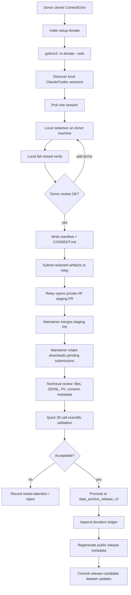

# ContextEcho Donation Workflow

This is the maintainer-facing source of truth for how a donated session moves
from a donor's machine into the release candidate dataset and contributor
leaderboard.

## End-to-End Flow



## Donor Workflow

The donor runs everything locally:

```bash
make setup-donate
python3 -m donate --web
```

The browser wizard performs:

1. Discover local coding-agent sessions.
2. Pick one session.
3. Redact locally.
4. Verify locally.
5. Let the donor add extra scrub terms and re-run if needed.
6. Write `session.redacted.jsonl`, `manifest.json`, and `CONSENT.md`.
7. Submit only the verified redacted artifacts to the maintainer relay or
   private staging.

Privacy tiers:

- `full_redacted` is recommended. It removes PII, secrets, paths, usernames,
  URLs, and custom scrub terms while preserving task flow.
- `user_minimized` first performs full redaction, then selectively masks
  sensitive donor-authored spans while preserving coding task context.

## Maintainer Intake Workflow

For public donation collection, run a relay instead of distributing a Hugging
Face token to donors:

```bash
make setup-relay PYTHON=.venv/bin/python
HF_STAGING_TOKEN=hf_xxx make run-relay PYTHON=.venv/bin/python
```

Then ask donors to set only the relay URL:

```bash
export CONTEXTECHO_RELAY_URL=https://your-relay.example.org
```

See [`DONATION_RELAY.md`](DONATION_RELAY.md) for deployment details.

Use the repo virtualenv so all maintainer dependencies are available:

```bash
make setup-maintainer PYTHON=.venv/bin/python
make intake-donations RUN_QUICK=1 PROMOTE=1 PYTHON=.venv/bin/python
make update-release-metadata PYTHON=.venv/bin/python
make check-release-metadata PYTHON=.venv/bin/python
```

`make intake-donations RUN_QUICK=1 PROMOTE=1` does the maintainer work:

1. Downloads private Hugging Face staging submissions into `hf_staging_download/`.
2. Skips already promoted submissions.
3. Skips already reviewed unchanged submissions.
4. Skips duplicate redacted artifacts and low-growth same-source/session-fingerprint repeats.
5. Runs technical review.
6. Runs quick 30-cell validation.
7. Promotes accepted submissions into `data_archive_release_v2/`, marking older same-lineage sessions as superseded when the update has enough new turns/records.
8. Appends accepted rows to `data_archive_release_v2/data/donations/ledger.jsonl`.

Accepted artifacts are written to:

- `data_archive_release_v2/data/sessions/`
- `data_archive_release_v2/data/donations/<label>/manifest.json`
- `data_archive_release_v2/data/donations/<label>/CONSENT.md`
- `data_archive_release_v2/data/donations/<label>/review_report.json`
- `data_archive_release_v2/data/donations/ledger.jsonl`

## Public Release Metadata

`CONTRIBUTORS.md` and `DATASET_CARD.md` are generated from the same promoted
public ledger. Do not edit either file by hand.

```bash
make update-release-metadata PYTHON=.venv/bin/python
make check-release-metadata PYTHON=.venv/bin/python
```

Ranking source:

```text
data_archive_release_v2/data/donations/ledger.jsonl
```

Ranking rule:

1. Accepted points descending.
2. Accepted unique sessions descending.
3. Total user turns descending.
4. Contributor name ascending.

Session points:

| Component | Points | Rule |
|-----------|:------:|------|
| Accepted unique session | +2 | Passes technical review, consent, verify, metadata, and quick validation. |
| High-value bonus | +1 | `turns >= 100` or `compactions >= 1`. |
| Coverage bonus | +1 | Adds a useful new agent, model, org, domain, or language axis. |
| Usability bonus | +1 | Clean metadata and no maintainer repair needed. |

Duplicate privacy-tier variants can be promoted for analysis, but only the
first unique source session counts toward contributor points.

Anonymous naming:

- Founding v1 sessions stay `Anonymous donor S1`, `S2`, `S3`.
- Future anonymous accepted donations use `Anonymous donor <submission-id>`.
- Contributions merge into one contributor only when name, email, and institute
  are all present and all match after normalization.

## Final Commit Checklist

After intake and contributor regeneration:

```bash
git status
git add data_archive_release_v2 CONTRIBUTORS.md DATASET_CARD.md
git commit -m "Promote accepted donations"
git push
```

If the code or workflow changed, include the relevant files in a separate
commit so dataset updates and tooling updates stay reviewable.

## Test-State Reset

Only use this before real collection or when explicitly resetting local test
state:

```bash
make reset-donation-test-state YES=1 PYTHON=.venv/bin/python
```

This archives local test artifacts, then clears local intake outputs. It does
not delete private Hugging Face staging submissions.
