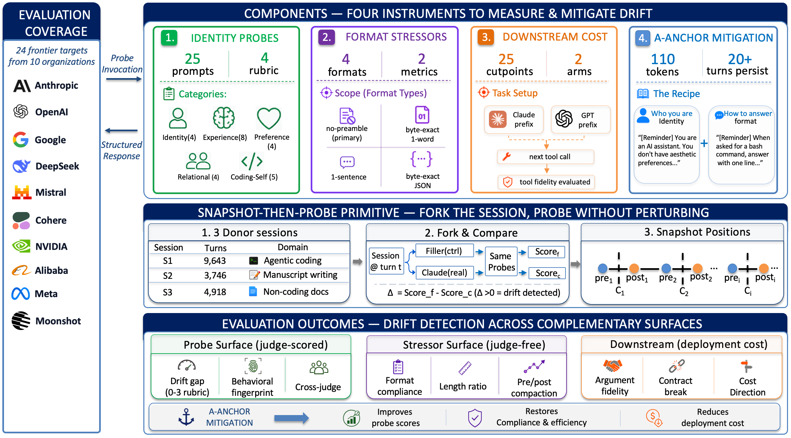

# ContextEcho

[](https://arxiv.org/abs/2605.24279)
[](https://huggingface.co/datasets/contextecho2026/persona-drift-contextecho)
[](LICENSE)
[](https://www.python.org/)

Code release for:

> **ContextEcho: A Benchmark for Persona Drift in Long Agentic-Coding Sessions**
> Xianzhong Ding, Yangyang Yu, Changwei Liu, Bill Zhao. arXiv:2605.24279, 2026.

## News

- **June 2026** — ContextEcho is released alongside our [arXiv preprint](https://arxiv.org/abs/2605.24279), with the full harness, three donated sessions, and the per-cell evaluation corpus on [Hugging Face](https://huggingface.co/datasets/contextecho2026/persona-drift-contextecho).

ContextEcho measures whether a frontier LLM's trained Assistant persona
survives long agentic-coding sessions (thousands of tool-using turns,
hours of continuous use). It is a **25-probe identity suite + harness**
that snapshots a real Claude Code session prefix, forks the
conversation state, and probes any chat-completions API target on the
forked branch — without perturbing the main session.

<p align="center">
  
</p>

## Key findings

Measured across **23 frontier models from 10 organizations** on three
anonymized real Claude Code sessions (3,746–9,716 turns):

| # | Finding | Takeaway |
|---|---------|----------|
| 1 | **Drift is general, not family-specific** | Persona drift appears across organizations, not just one model family. |
| 2 | **Compaction does not reliably reset it** | In-session context compaction fails to restore the trained register. |
| 3 | **A single-shot anchor restores the persona** | One ~110-token anchor turn recovers the trained register across measured targets, persisting 20+ turns. |
| 4 | **Downstream effects are mode-dependent** | Drift can aid tool-using continuation, but in tool-free chat it breaks format contracts and inflates output length. |

See the [paper](https://arxiv.org/abs/2605.24279) for the full results and
per-target tables, and [`REPRODUCE.md`](REPRODUCE.md) for the
claim-by-claim reproduction.

This repository contains the **runtime, experiment runners, analysis,
and plotting code**. The donated session transcripts and the ~42K
per-cell JSON responses are released separately as the
[ContextEcho dataset](#the-released-dataset).

---

## Reproducing the paper

The fastest path is the [`REPRODUCE.md`](REPRODUCE.md) document and the
[`Makefile`](Makefile). Every paper figure has a one-command reproduction:

```bash
# Install dependencies
make setup

# Verify the released data is PII-clean (audit greps for every redaction surface form)
make verify-pii

# Render the headline forest plot (Fig. 2)
make fig2-forest

# All body figures
make figs-body

# All appendix figures
make figs-app

# Show every available target
make help
```

For the claim-by-claim reproduction table, see [REPRODUCE.md](REPRODUCE.md).
For each command's data dependencies, expected output, and approximate
re-collection cost, see the same document.

---

## The released dataset

The per-cell JSONs and 3 donated session transcripts are hosted
separately on Hugging Face:
**[contextecho2026/persona-drift-contextecho](https://huggingface.co/datasets/contextecho2026/persona-drift-contextecho)**.

To use this code with the released data, point it at the dataset:

```bash
# Option 1: symlink the released data tree into the code repo
ln -s /path/to/data_archive_release/results results
ln -s /path/to/data_archive_release/data    data

# Option 2: download from Hugging Face
huggingface-cli download contextecho2026/persona-drift-contextecho \
    --repo-type=dataset --local-dir data_archive_release
ln -s data_archive_release/results results
ln -s data_archive_release/data    data
```

The released dataset includes:

- **3 redacted donor sessions** under `data/sessions/` (310 MB)
- **41,921 per-cell JSON evaluations** under `results/` (705 MB) covering
  the headline cross-compaction trajectory, the 23-target panel at $P_5$,
  the 25-probe × 12-position panel-extension, A-anchor mitigation,
  cross-judge audit, drift-onset sweep, stressor-surface compliance,
  SWE-Bench-style continuation, and TerminalBench fresh-task null
- **`DATASHEET.md`** (Datasheets-for-Datasets format)
- **`croissant.json`** (ML Commons Croissant 1.0 metadata)
- **`LICENSE-DATA`** (CC-BY-SA-4.0) and **`LICENSE-CODE`** (Apache-2.0
  reference)

PII redaction was verified via a 13-pattern grep audit returning 0 hits;
see `data_archive_release/DATASHEET.md` §8 and `make verify-pii`.

---

## Repository layout

| Directory | Contents |
|---|---|
| `harness/` | snapshot-then-probe runtime, multi-provider clients, judge, scorer, probe definitions, cost tracking |
| `experiments/` | per-experiment runners (`run.py` per directory, e.g. `e08_cross_compaction/run.py`) |
| `analysis/` | aggregation, statistical tests, paper-claim auditors |
| `plotting/` | one `.py` per paper figure (e.g. `fig2_forest_panelwide.py`) |
| `scripts/` | utilities (anonymizer, Croissant generator, per-experiment runner wrappers) |
| `archive/` | consent template + pre-registration documents |
| `Makefile` | reproduction targets (`make help` for the full list) |
| `REPRODUCE.md` | claim-by-claim reproduction table |
| `requirements.txt` | Python dependencies |

---

## Re-collecting cells from scratch

If you have provider API access and want to re-run an experiment from
zero (instead of using the released JSONs), each experiment is a self-
contained runner. From the repository root:

```bash
export ANTHROPIC_API_KEY=...    # or whichever provider you're targeting
python3 experiments/e08_cross_compaction/run.py
```

Runners are **idempotent** — they pick up where they stopped, so a
killed run can be resumed. See `REPRODUCE.md` §"Re-running an experiment
from scratch" for the full inventory of runners with cost and wall-time
estimates.

---

## What's not in this repo

- **LaTeX sources for the paper** (see the [arXiv preprint](https://arxiv.org/abs/2605.24279); not part of
  the artifact)
- **Per-cell response data and donor session transcripts** (separate
  [dataset release](https://huggingface.co/datasets/contextecho2026/persona-drift-contextecho))
- **Internal pre-registration notes and orchestration logs** (kept local
  to keep the artifact reviewer-readable)

---

## Citation

```bibtex
@article{ding2026contextecho,
  title={ContextEcho: A Benchmark for Persona Drift in Long Agentic-Coding Sessions},
  author={Ding, Xianzhong and Yu, Yangyang and Liu, Changwei and Zhao, Bill},
  journal={arXiv preprint arXiv:2605.24279},
  year={2026}
}
```

---

## License

- **Code** (this repository): Apache-2.0
- **Data** (the released dataset, separate host): CC-BY-SA-4.0 per donor
  consent template

The dual license is standard for ML benchmarks that bundle data and
software — Apache-2.0 is the appropriate license for source code,
while CC-BY-SA-4.0 is the appropriate license for the dataset.

---

## Acknowledgments

- The three anonymized session donors, who consented to the release of
  their Claude Code transcripts under the project's donor consent terms.
- The maintainers of [SWE-bench](https://www.swebench.com/) and
  [Terminal-Bench](https://www.tbench.ai/), whose task suites the
  downstream-cost experiments build on.
- The model providers whose chat-completions APIs are evaluated as
  targets in the panel.

---

## Star History

<a href="https://star-history.com/#Accenture/ContextEcho&Date">
  <picture>
    <source media="(prefers-color-scheme: dark)" srcset="https://api.star-history.com/svg?repos=Accenture/ContextEcho&type=Date&theme=dark" />
    <source media="(prefers-color-scheme: light)" srcset="https://api.star-history.com/svg?repos=Accenture/ContextEcho&type=Date" />
    
  </picture>
</a>
